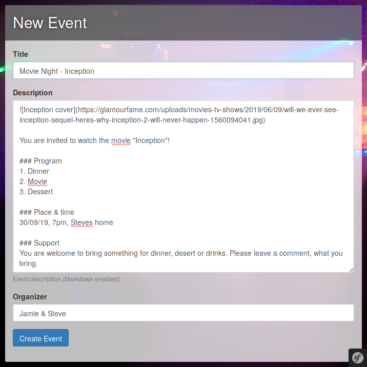
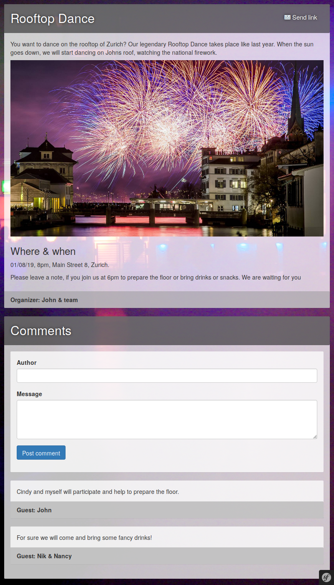
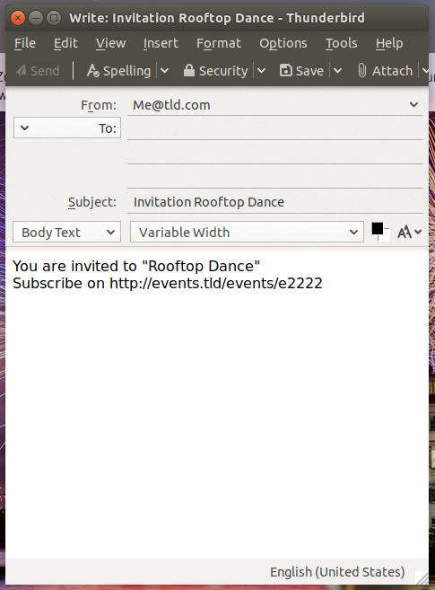

# La Fete Webapp


&nbsp;
&nbsp;



<p>


</p>


## Project documentation

* [Architecture](https://github.com/moonline/la-fete/wiki/Architecture)
* [Wireframes](https://github.com/moonline/la-fete/wiki/Wireframes)
* [User Stories](https://github.com/moonline/la-fete/issues?utf8=%E2%9C%93&q=label%3A%22type%3Astory%22)
* [All open issues](https://github.com/moonline/la-fete/issues)


## Development

### Setup

1. Install PHP, Composer, Symfony, php-xdebug, SQLite, php-X.Y-sqlite, [ SQLite-browser ]
	* https://docs.aws.amazon.com/elasticbeanstalk/latest/dg/php-development-environment.html
	* https://www.ionos.com/community/hosting/php/install-and-use-php-composer-on-ubuntu-1604/
	* https://symfony.com/download
	* https://www.zyxware.com/articles/5765/how-to-install-php-debugger
	* https://linuxhint.com/install_sqlite_browser_ubuntu_1804/
	* https://stackoverflow.com/questions/948899/how-to-enable-sqlite3-for-php
	* [ https://sqlitebrowser.org/ ]
2. Clone source
3. Install dependencies
	```bash
	composer install
	```


### Create database & test data

Migrate database:
```bash
php bin/console doctrine:database:create
php bin/console doctrine:migrations:migrate
```
Insert test records:
```bash
composer generate-test-data
# or
./generate_test_data.sh
```


### Start development server

```bash
symfony server:start
```
Open http://localhost:8000 in a browser


### Testing

Run tests:
```bash
composer test
# or
./bin/phpunit
```


## Development environment (vs-code)

## Usefull extensions
* DotENV
* PHP Debug
* PHP IntelliSense
* Twig
* Preview

## Debugging

* https://scotch.io/@chenster/debugging-php-in-visual-studio-code205
* http://www.accella.net/knowledgebase/debugging-php-with-visual-studio-code/